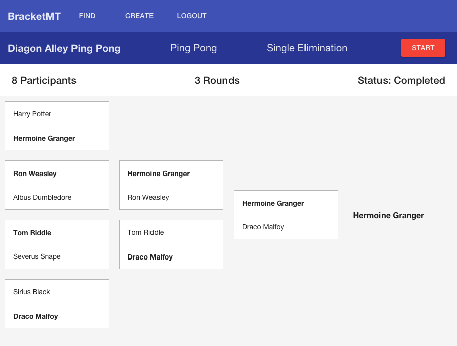

# BracketMT
BracketMT is an auto-sizing bracket creator app for single elimination tournaments! BracketMT is a full stack JavaScript app built with the MEAN stack -  AngularJS, Node/Express, and MySQL/Sequelize - and is ready to host your company's next ping-pong tournament ([bracketmt.com](http://www.bracketmt.com)).

## Table of Contents

1. [Usage](#Usage)
2. [Requirements](#requirements)
3. [Development](#development)
  1. [Installing Dependencies](#installing-dependencies)


## Usage

Create, manage, and vizualize auto-sizing single-elimination tournament brackets with BracketMT. 

- Register for a secure BracketMT account with your name and email
- Explore existing tournaments by Type (Ping Pong, 3x3 Basketball) or Status (Upcoming, In-Progress, Completed)
- Create your own tournaments with auto-sizing brackets based on number of participants
- Join existing 'Upcoming' tournaments
- Visualize and manage 'In-Progress' tournament brackets

### Example tournament bracket



## Requirements

### Frontend

- angular
- angular-ui-router
- angular-material
- angular-material-data-table
- angular-animate
- angular-aria

### Backend
  
- node
- express
- bcrypt-nodejs
- bluebird
- body-parser
- bower
- crypto
- express
- jwt-simple
- mysql
- sequelize

### Deployment

- Docker
- DigitalOcean

## Development

### Installing Dependencies

```sh
npm install
```

From within the `client` directory:
```sh
bower install
```
